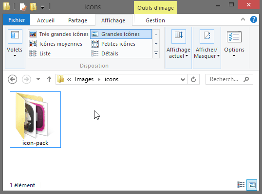

# PNG to ICO

## About
[KISS](https://en.wikipedia.org/wiki/KISS_principle) batch script to easily convert PNG, GIF, BMP, SVG or JPG images to multi-resolution [ICO](https://en.wikipedia.org/wiki/ICO_(file_format)) files using [ImageMagick](https://www.imagemagick.org/script/index.php).  
Don't want to deal with Command Line or install a heavy, bloated program ? Well, you're in the right place !

## Usage

On Microsoft Windows, from File Explorer, right clic an image file or a folder containing image files, and select `PNG to ICO`.  
If you don't want to use the provided installer (`png_to_ico_setup.exe`), drag & drop a folder or an image to `png_to_ico.bat`.  

Default included resolutions in ICO files are 256x256, 128x128, 96x96, 64x64, 48x48, 32x32, 24x24, and 16x16 pixels.  
Icons are generated in same folder as original image files, with corresponding filename.  
Stable version of [ImageMagick](https://www.imagemagick.org/script/index.php) `convert` program is built-in.

## Requirements
- Microsoft Windows

## License
PNG to ICO is released under the [Unlicense](http://unlicense.org).